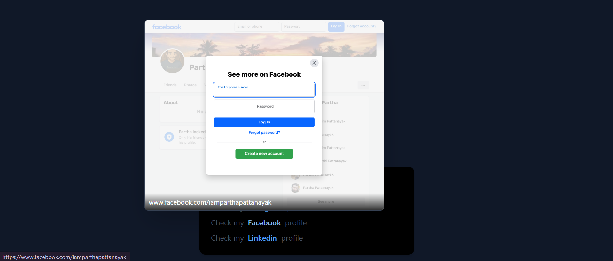

# 🔗 Link Previewer App

## A simple React project that displays a live website preview when hovering over social media profile links using the Microlink API.

## 🔗 Live Demo

👉 [https://link-preview-mu-nine.vercel.app/](https://link-preview-mu-nine.vercel.app/)

---

## 📸 Screenshots

| Screenshots                                     |
| ----------------------------------------------- |
|  |

---

## 🚀 Demo

Hover over these links to preview the pages:

- [Instagram](https://www.instagram.com/iamparthapattanayak/)
- [Facebook](https://www.facebook.com/iamparthapattanayak)
- [Linkedin](https://www.linkedin.com/in/partha-pattanayak-082a46320/)

---

## 🧰 Tech Stack

- React
- Tailwind CSS
- Framer Motion
- Microlink API

---

## 🧪 Getting Started

### 📦 Installation

Clone the repo :

```bash
git clone https://github.com/PARTHA-PATTANAYAK-02/Link_Preview.git
cd link_preview
```

install dependencies:

```bash
npm install
```

also see the package.json

Run the development server :

```bash
npm run dev
```

---

## 🌐 Deployment

## This project can be deployed easily using:

- ### 🔗 [vercel](https://link-preview-mu-nine.vercel.app/)

## ✍️ Author

**Made with ❤️ by [Partha Pattanayak](https://github.com/PARTHA-PATTANAYAK-02)**
